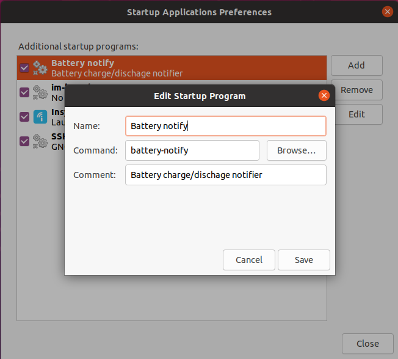

# Battery Notify

## Overview

This script displays a notification to remind you to plug or unplug the charger when the battery level goes below 50% or above 60%.

## Context

To prolong battery life, it's best to keep it charged between 50%-80%. Keeping it completely full (or empty) stresses the battery, and degrades it faster. See this ArsTechnica article on [the best way to use a lithium-ion battery, redux](https://arstechnica.com/gadgets/2014/04/ask-ars-the-best-way-to-use-a-lithium-ion-battery-redux/).

Most laptops with Windows preinstalled have an utility that can stop charging when the battery reaches 80% to extend the battery's life. This utility stops working if you dual boot into Linux.

## Goals and non-goals

#### Will do
- Remind the user to plug in or unplug the laptop charger when the battery reaches predefined minimum or maximum threshold.
- Work with my model of LG Gram laptop.

#### Won't do
- Automatically start/stop charging when the thresholds are reached. This is probably firmware-level stuff. My code-fu isn't remotely there yet.
- Work with other laptop brands/models.

## Milestones
- [x] Poll and print the battery status.
- [x] Determine when to notify start/stop charging.
- [x] Display a system notification.
- [x] Run continuously
- [x] Autostart on login

## Technical Architecture (WIP)
- Target operating system: Ubuntu 18.04 x64
- Target hardware: 2018 LG Gram
- Programming language: python 3.7

Source of battery stats:

`/sys/class/power_supply/CMB0/capacity`

`capacity` is a text file that contains a value (0 - 100). It represents the current battery charge level. On other systems, the battery stats may be listed under a `BAT0` directory.

Source of AC adapter state:

`/sys/class/power_supply/ADP1/online`

`online` is a text file that contains a value (0 - 2). It represents the state of power supply (VBUS):

- 0: Unplugged
- 1: Plugged in: Fixed Voltage Supply
- 2: Plugged in: Programmable Voltage Supply

Reference: https://www.kernel.org/doc/Documentation/ABI/testing/sysfs-class-power

## Installation
1. `chmod +x battery-notify.sh`
1. `sudo cp battery_notify.py /usr/local/src`
1. `sudo cp battery-notify.sh /usr/local/bin/battery-notify`
1. Add `battery-notify` to your startup application settings (see screenshot)
1. Logout and log back in

